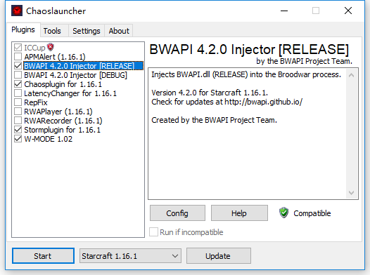

* TOC
{:toc}

*本文主要参考（翻译）了TorchCraftAI项目的官方文档[Tutorials](https://torchcraft.github.io/TorchCraftAI/docs/bptut-intro.html)并加入了自己在阅读和实验中的一些坑和理解*

## 模块抽象

### Player

Player类调用事先连接到server上的TorchCraft client并推进游戏主循环：接收游戏state update，bot内部循环，并向server发送命令

### State Representation

current game state (with per-Player State object)

* current map in-game units
* via TilesInfo, AreaInfo UnitsInfo

internal bot state (with per-State Blackboard instance)-黑板实例

* key-value storage
* communication via UPCTuples
* maintains Tasks

### Modules

封装了一个bot的具体行为集合

module实现step()接口，并被加入到Player实例，在每一帧游戏中被调用

包括 [链接](https://torchcraft.github.io/TorchCraftAI/docs/modules.html)

* 生产-收集-攻击（CreateGatherAttack）
* 策略（Strategy）
  * 建筑顺序（BuildOrder）
  * 侦查（Scouting）
  * 骚扰（Harassment）
* 通用自动建造（GenericAutoBuild）
* 建筑放置器（BuildingPlacer）
* 建造器（Builder）
* 战术（攻击/逃跑）（Tactics delete/flee）
* 团战（攻击/逃跑/放风筝/burrow）（SquadCombat attacking/fleeing/kitting/burrowing）
* 侦查（Scouting）
* 收集器（Gatherer）
* 骚扰（Harass）
* 稳定防守集火（StaticDefenceFocusFire）
* UPCToCommand

### UPCTuples

单位-位置-命令（Unit-Position-Command）元组

该元组被Modules筛选，直到可以被翻译为一个真实***游戏命令***

***游戏命令***代表一个事先规定好的一组抽象游戏指令

Modules通常完成如下逻辑：

* 检测（生成）可行UPCTuples，通过黑板实例（Blackboard），如下图中右侧黑板+白字
* 执行UPCTuples
* 发布一个或几个筛选出的TPCTuples

UPCTuples还加入了state字

范例：


说明：

***策略***模块首先生成在units和position上均匀分布的UPCTuple，而在command上为Dirac分布（只有"create"命令），Build Order作为state附加项

***自动建造***模块是建筑设计模块，具体实现建筑顺序，逐渐演变出多个UPCTuples，每个UPCTuple表示一种可选建筑

***建筑放置***模块是针对建筑的位置筛选模块，对选定位置有概率1而其他位置为概率0

最终***建筑***模块选择一种UPCTuple并实际操作，这一步会花费较多时间

所有*可执行*的UPCTuple（即所有相关域都为Dirac分布的UPCTuple）都会被U***PCToCommand***模块翻译为TorchCraft的游戏指令

### Tasks

Task对象用来实现具体UPCTuple（Task和UPCTuple一一对应）

Task的功能：

* 向其他Module发送UPCTUple的具体实现，并报告相关status
* 分配units。如果实现UPCTuple需要控制unit，units被分配到相关Task。units只能在Task生成时加入，之后只能移除不能加入
* 可以通过proxy追踪UPCTuples的实现（若后续Module失败可以重启上一步）
* 可以存储必要数据

Tasks实现update()方法以根据内部事件（如unit的重新分配和Task的取消）和外部事件（如执行必要行动的unit被摧毁）更新status

### Controllers

从属于Task对象，但实现了类似Module的step()入口，并提供了方便的方法来管理unit以及发布每个unit的UPCTuples到黑板上

共享控制器（SharedController）是一个持久的控制器用以方便地增加和删除unit。该控制器在多个Task之间共享，通过中心化方法实现多个UPCTuples

不参与unit控制的Modules通常直接通过step()方法筛选UPC，并直接把结果发布在黑板上

### 训练基本框架

## Tutorial模块

**由于训练部分依赖了外部库 `goo` ([github](https://github.com/facebookincubator/gloo)) 以支持分布式训练，该库仅支持Linux，所以模型训练部分只支持Linux client + Windows Server模式**

TorchCraftAI提供的教程包括**建筑放置**和**微操**

### 建筑放置

建什么？

在哪建？

建筑放置器（BuildingPlacer）模块，输入为"Create"命令和指定建筑类型。Module通过位置分布提炼出最后的位置。

实际建造过程由建造器（Builder）模块完成，但建筑放置器会通过proxy task追踪这一过程，如果建造过程失败会重试，直到建造成功

### 行为空间限制

实际需要联合学习***何时建***，***建什么***和***建在哪***

在此默认建筑位置已经被圈定到特定区域内（通过TorchCraftAI中包含的BWEM (Brood War Easy Map)类确定，该类可以提供地图的各项信息如子区域，交通要道点和基地位置等）


输入为指定建筑类型和指定区域以及游戏当前状态

输出为放置建筑的位置分布

#### 神经网络结构

SC中的位置标识方式

* pixels
* walktiles (8x8)
* buildtiles (4x4 walktiles，32x32 pixels)

#### 输入特征

（用average pooling将walktiles转换成buildtiles）

* 建筑类型
* 可选位置（UPC）
* 地面高度（0,1,2）
* 可通过性（0,1）
* 可建造性（0,1）
* 战争迷雾（0,1）
* 是否creep（0,1）*注：虫族的栖息地周围蔓延着一种有机质"creep"，虫族的建筑亦必须在这层Creep上建造。*
* 敌军可能出生点（用1标注，通常地图包括2-4个出生点，随着侦查可将其中一些验证过的出生点置为零）
* 路障点（不可建造，但可被利用进行战术决策）
* 单位（列表列出所有存活单位，友方，可见敌方和中立单位，离散特征，包括单位类型+单位位置）

不同大小地图用zero-padding扩充

输入范例：


##### 输出

输出为全地图范围内的建筑放置概率分布（每个buildtile的放置概率）

RL部分输出增加一层mask使非法位置概率为0

##### 推理模型

CNN模型

金字塔结构类似：


128x128 -> 64x64 -> 32x32 (x4) --(lateral connection)-> 64x64 --(lateral connection)-> 128x128 -> softmax -> probability

##### 特征整合

大部分特征可以复用128x128 CNN模型，但unit信息特征为离散向量

使用lookup table将地图上的单位类型（one-hot）映射到低维空间。映射向量被放置在单位出现的位置，多个单位同时出现的情况则简单加和

建筑类型与地图单位类型处理方式类似，但由于没有位置概念，其映射值被直接复制到全地图

特征整合发生在UPCTuple传递到BuildingPlacerModel一步

代码范例：

```cpp
// Embed units and requested type
// map       [batchSize, mapChannelNum, sizeX, sizeY]
// unitsPos  [batchSize, unitsNum, 2]
// unitsData [batchSize, unitsNum, 1]
// type      [batchSize]
auto unitsT = embedU->forward({unitsData})[0].squeeze(2);
auto typeT = embedT->forward({type})[0];

// Place on 2D map. For now, handle each sample in the mini-batch individually
auto units2d =
    common::scatterSum2d(unitsPos, unitsT, {map.size(2), map.size(3)});
auto type2d = typeT.unsqueeze(2).unsqueeze(2).expand(
    {typeT.size(0), typeT.size(1), map.size(2), map.size(3)});

// Prepare input to convolutions
torch::Tensor x = at::cat(
  {
    map,
    units2d.to(map.options().device()),
    type2d.to(map.options().device())
  }, 
  1
);

// Up the pyramid
x = at::relu(conv1->forward({x})[0]);
torch::Tensor outC1 = x;
x = at::relu(conv2->forward({x})[0]);
torch::Tensor outC2 = x;
x = at::relu(conv3->forward({x})[0]);
torch::Tensor outC3 = x;

// Through top convs
for (auto i = 0U; i < convS.size(); i++) {
  x = at::relu(convS[i]->forward({x})[0]);
}

// Back to original output resolution
x = common::upsample(x, common::UpsampleMode::Nearest, 2);
x = dconv2->forward({x})[0];
x = at::relu(x + skip2->forward({outC2})[0]);
x = at::relu(postskip2->forward({x})[0]);

x = common::upsample(x, common::UpsampleMode::Nearest, 2);
x = dconv1->forward({x})[0];
x = at::relu(x + skip1->forward({outC1})[0]);
x = at::relu(postskip1->forward({x})[0]);

torch::Tensor y = out->forward({x})[0].view({batchSize, -1});
```

#### 监督学习

[训练数据](https://github.com/TorchCraft/StarData) 来自TorchCraft，包含65646局游戏记录

完整数据集包括1535M帧游戏，496M的玩家行为，压缩后356G，帧率降到8fps

[论文介绍](https://arxiv.org/pdf/1708.02139.pdf)

##### 采样

[代码](https://github.com/TorchCraft/TorchCraftAI/blob/master/scripts/building-placer/collect-replay-samples.cpp)

首先重放游戏，记录各项数据信息

动作数据从建造结果倒推获得

游戏数据被压缩存盘

分解为训练集验证集测试集

##### 训练过程

输入为各个图层，输出为128x128=16384维向量的多分类问题。

官方分类结果为：


##### 综合评测

对比Baseline为基于Training Set的Nearest Neibour模型

### RL

#### 通过Masking的行为空间限制

由于很多区块是先天无法放置建筑，所以监督学习部分的128x128=16384维输出本身有很多是冗余的

在监督学习中，可建筑区域被作为一层输入图层送入分类器，但是对RL来说从中学习出相关逻辑较为耗时，因此在RL任务中直接用Mask将其屏蔽

softmax计算变为：

$$
{masked\_softmax(x, m)}_i = \frac{m_ie^{x_i}}{\sum_{i} m_ie^{x_i}}
$$

这一步将行为空间从16384压缩至10-50

#### reward定义

$$
R(a_t)=\begin{cases}
+0.5, &a_t建筑成功开始并最终取得胜利\\
-0.5, &a_t建筑成功开始并最终取得失败\\
0, &其他
\end{cases}
$$

#### 主循环（train-rl.cpp）

官方结果：胜率从基于规则的65.8%提升至78.5%

### 微操

#### 行为空间

移动到何处？

攻击什么单位？

模型输出为：

* 选取行动的概率分布
* 攻击目标的概率分布
* 移动目标的概率分布（以主体为中心的20x20的walktile范围）

首先确定采取什么行动 -> 再决定选取攻击目标/移动目标

TorchCraftAI提供了多种scenarios，提供多种微操场景

#### 对方策略

* attack_move
* closest
* weakest

#### 模型

##### 输入

地形特征+单位特征

地图信息包括

* 可达性（地图点能否到达）
* 可建筑行（地图点能否放置建筑）
* 地面高度（上下坡设计会影响miss率）
* 战争迷雾
* X, Y坐标（tile的绝对坐标）

单位信息包括

* 位置
* 速度
* 血量
* 护甲
* 能量
* 射程
* 伤害
* 伤害类型
* ...等等

***以上特征包括必要的归一化处理到[-1, 1]***

##### 模型结构

输入：

* mapFeats
* ourLocs: [U, 2], (y, x)
* outFeats: [U, featNum]
* nmyLocs: [U, 2], (y, x)
* nmyFeats: [U, featNum]

U = unitNum or enemyNum

##### MLP对unitFeats用encoder编码

##### potential field

分别用四个网络处理编码后输入，输出友军和敌军的embedding和[potential field](http://aigamedev.com/open/tutorials/potential-fields/) parameterization

embedding net输出为U x EmbedNum的tensor
potential field输出为U x 2（2个parameter）的tensor

embedding网络决定potential field中包含什么unit，parameter决定威胁强度（核函数）

假设$e_i$是embedding的第$i$维数值，在地图中的任意一个坐标点，势能p可以表示为该坐标点到单位的距离d的函数：

$$
F(e, w_1, w_2)=e\times\begin{cases}
1 &d \leq w_1\\
\frac{w_2 + w_1 - d}{w_1} & w_1 < d \leq w_1 + w_2\\
0 &d > w_2
\end{cases}
$$

其中$w_1$和$w_2$为parameter net输出

最终输出为width x height x 2embedNum的spatial potential field

每个unit的embedding向量为spatial potential field中unit对应位置的值

> 个人理解：
>
> 敌我每个单位包含坐标(x, y)和feature，feature经过encode和embedding之后变为等长向量，根据所在位置(x, y)和势能核(w1, w2)将embedded vectors张成势能图，势能核为加权值，经过sum和max pooling之后最终基准特征为两倍embedding（敌我）维度的图层集合
>
> 再在spatial potential field中抽取对应unit位置的向量作为特征（spatial embedding）

##### movement action net

1. ***ourMovementScores***

输入行为单位周围20 x 20的movement plane，包括

potential field片段（2E），连接map embedding（E_map）之后的片段，再连接unit的embedding片段（E）

送入3层CNN `movementNetwork_`，输出20x20维的移动分数 ***ourMovementScores***
2. ***ourAttackScores***

输入为final unit embedding + distance

final unit embeddings为当前单位的embedding和spatial embedding的串联（即本身的embedding和其他单位的势能embedding，维数为E+2E）

distance为敌我单位两两之间欧氏距离

另将敌我两两之间final unit embedding向量拼接起来，最终输入为[ourUnitNum, enemyUnitNum, 2x(E+2E) + distance]的tensor

送入`attackNetwork_`，得到ourUnitNum x enemyUnitNum维数的攻击分数
3. ***ourCommandScores***

输入为我方单位的final unit embeddings

`commandNetwork_`输出ourUnitNum维度的命令分数

最终三个分数一同返回

#### 训练

使用Evolution Strategies（ES，演化策略）

##### reward

1/2(输赢)+1/4(击杀率)+1/8(我方存活率)+1/16(造成敌方伤害率)

## 具体实验

训练过程必须在Linux系统上（bp模块和micro模块）

Linux上的训练设置可以不用安装游戏，只需要从Windows安装目录中将下列文件拷贝到Linux系统中某文件夹中（如MBQ/）然后设置环境变量
`export OPENBW_MBQ_PATH=MBQ`，即可启动训练模块

### 启动命令

BP：

`./build/tutorials/building-placer/bp-train-rl -v -1 -vmodule train-rl=1`

会在根目录下生成`checkpoint`文件，改名为xxx.bin拷贝到Windows系统中可以被cherrypi载入调用

micro:

`./build/tutorials/micro/micro_tutorial -vmodule state=-1,micro_tutorial=1 -scenario vu_zl` 

会在根目录下生成`train_micro.bin`文件

调用命令（Windows）：

参照[链接](https://torchcraft.github.io/TorchCraftAI/blog/)

`cherrypi.exe -hostname 127.0.0.1 -port 11111 -bp_model bwapi-data/AI/bp_model.bin`

### 对战

#### bot v.s. computer

命令行启动cherrypi.exe的agent，然后用Chaoslauncher.exe勾选`BWAPI 4.2.0 Injector [RELEASE]`选项，点击Start启动游戏



（注意W-MODE 1.02插件可以使游戏以窗口形式运行，但该插件会被McAfee误杀，需要添加例外）

选择Single Player -> Expansion -> 选定或新建ID -> Play Custom -> 选定地图 -> Game Type选Melee模式 -> 用户种族选择Zerg -> 添加Computer -> Ok启动

#### player v.s. bot

1. 还是命令行cherrypi.exe的agent，用Chaoslauncher-Multiinstance.exe先启动server游戏

2. 选择Multiplayer -> Expansion -> Local PC (或Local Area Network [UDP]如果网络支持且需要) -> 选定主机用户ID -> Create Game -> 选定地图 -> 用户种族选择Zerg -> 等待

3. 另在Chaoslauncher-Multiinstance.exe中去除`BWAPI 4.2.0 Injector [RELEASE]`的勾选（否则会报错），点击Start启动游戏

4. 同样选择Multiplayer -> Expansion -> Local PC -> 选定主机用户ID（注意和主机用户ID区分） -> 就会看到上一步生成的游戏，点击加入，在server上看到加入成功点击Ok开始游戏即可
